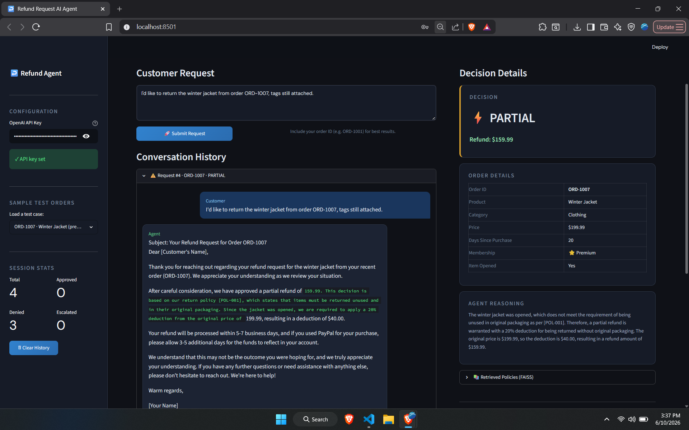
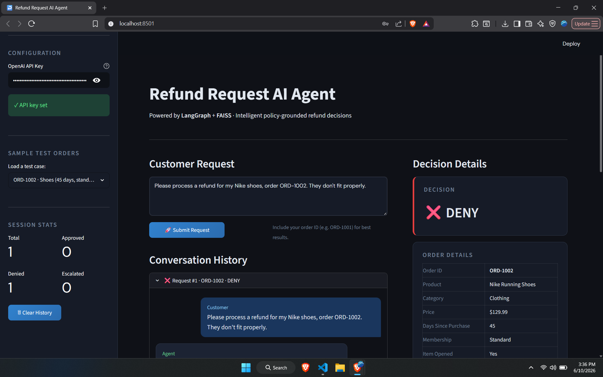

# Refund Request AI Agent

An intelligent refund processing agent built with **LangGraph**, **FAISS**, and **GPT-4o-mini**.

---

## Architecture

```
START
  │
  ▼
extract_info         ← LLM parses order ID + refund reason from message
  │
  ▼
validate_order       ← Looks up order in the database
  │
  ├─ NOT_FOUND ─────► generate_response (order not found)
  │
  ▼
retrieve_policy      ← FAISS similarity search over 10 policy documents
  │
  ▼
evaluate_eligibility ← LLM decides: APPROVE / DENY / ESCALATE / PARTIAL
  │
  ├─ ESCALATE ──────► escalate_handler → END
  │
  ▼
generate_response    ← Drafts empathetic customer-facing response
  │
  END
```

## Example Output



### Key Components

| File | Purpose |
|------|---------|
| `knowledge_base.py` | FAISS vector store with 10 refund policy documents |
| `order_db.py` | Simulated order database with 7 test orders |
| `refund_agent.py` | LangGraph agent — nodes, edges, routing logic |
| `app.py` | Streamlit web interface |


---

## Test Orders

| Order ID | Product | Days | Notes |
|----------|---------|------|-------|
| ORD-1001 | Sony Headphones | 10 days | Premium member, opened |
| ORD-1002 | Nike Shoes | 45 days | Standard member, outside window |
| ORD-1003 | Adobe License | 5 days | Non-refundable software |
| ORD-1004 | Dell Laptop | 3 days | Unopened, premium member |
| ORD-1005 | Custom Watch | 7 days | Personalized, non-refundable |
| ORD-1006 | Samsung TV | 2 days | Defective — eligible for full refund |
| ORD-1007 | Winter Jacket | 20 days | Premium, tags attached |

---

## Agent Decision Logic

- **APPROVE** — Within return window, item in eligible category, meets policy requirements
- **PARTIAL** — Opened electronics (restocking fee), late return (10% fee), missing packaging
- **DENY** — Software licenses, personalized items, final-sale items, outside return window
- **ESCALATE** — Unusual circumstances, ambiguous cases, medical/emergency claims
